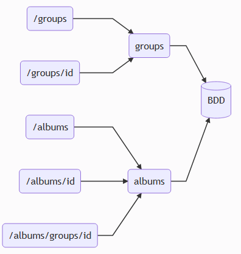

# Purpose
Node API allowing to create/read/update/delete music groups and albums details
# Quick start
Run the commands : 

`docker pull dutoitlouis/cybersecu-app`  
`docker run -p 4040:8080  dutoitlouis/cybersecu-app`

The app is now running on http://localhost:4040/
# Test
Import the `tests/API_test.json` in Insomnia/Postman or alike, every API route is called in it
# Analysis
- On utilise [Mongoose](https://www.npmjs.com/package/mongoose) pour gérer la connection avec la BDD.

- Les schemas [Mongoose](https://www.npmjs.com/package/mongoose) utilisés dans le dossier `/models` permettent d'imposer le type des éléments envoyés dans la base de données, cela mitige les injections mais selon le type envoyé il peut aussi être bon d'ajouter une bibliothèque comme [mongo-sanitize](https://www.npmjs.com/package/mongo-sanitize) pour permettre d'échapper tous les caractères d'instructions de MongoDB, pour tester cela on peut simplement essayer d'envoyer des requêtes malveillantes sur des tables de test et observer le résultat.

- Dans `config/db.js` on utilise la bibliothèque [dotenv](https://www.npmjs.com/package/dotenv) pour pouvoir utiliser des variables d'environnements dans un fichier `.env`, cela permet par exemple de stocker l'URI de connexion à la BDD sans le dévoiler, sans cela n'importe qui pourrait s'y connecter, la base étant hébergée, c'est le seul point d'entrée.

- Il n'y a pas de systèmes de gestion de comptes, mais un système comme OAuth 2.0 serait à privilégier pour avoir un bon niveau de sécuritié.

# Security
Attack surface :  

  

Schema :  

  

Objectives : 

Confidentialité : Une fuite de données n'est pas très grave dans ce cas, sauf si l'album posté est censé rester secret, il n'y a pas de données personnelles stockées dans la base. (1/5)

Intégrité : Les données sont sauvegardées périodiquement, si elles sont modifiées on pourra donc les restaurer mais si la sauvegarde est trop ancienne on peut perdre certaines données. (1/5)

Disponiblité : Le service proposé par l'API n'est pas un service essentiel, sa coupure n'aura pas un énorme impact, sauf pour les quelques personnes mécontentes qui essaieront de l'utiliser, de plus les données sont stockées en utilisant le service cloud de MongoDB (Atlas), elles sont répliquées sur trois nodes pour assurer une disponibilité maximale (1/5)

Traçabilité : Les données n'étant pas essentielles, savoir d'où viennent les appels API n'est pas primordial, les logs sont tout de même stockés dans MongoDB. (1/5)

# Stack
Node.JS with Express.JS and MongoDB
# Author
Louis DUTOIT
